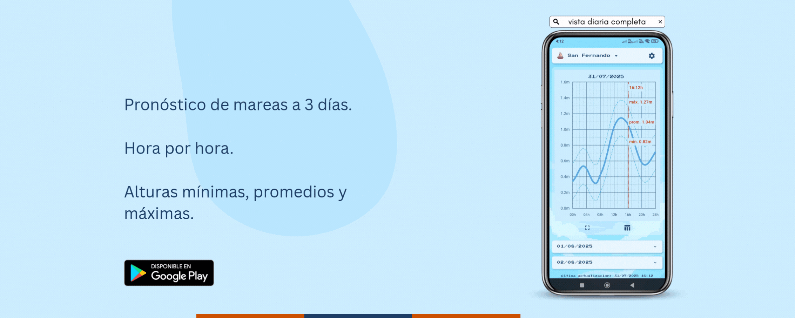

# Mareas — App de alturas de marea + clima (Flutter + Django ETL)

**Mareas** muestra la curva de marea por estación y la enriquece con pronóstico meteorológico. El backend corre un **ETL en Python/Django** que integra datos del **INA** y del **SMN**, los transforma y los deja listos en **JSON cacheado** para que el frontend en **Flutter** los consuma con experiencia **offline-first**.

[▶︎ Descargar en Google Play](https://play.google.com/store/apps/details?id=com.appmareas.app_mareas)

<p align="center">
  <a href="https://play.google.com/store/apps/details?id=com.appmareas.app_mareas" title="Descargar en Google Play">
    
  </a>
</p>

---

## Qué hace

- **Ingesta (Extract):** descarga alturas hidrométricas del INA (JSON) y el pronóstico “pron5d” del SMN (ZIP/TXT).
- **Transformación (Transform):**

  - Agrupa por **fecha/hora** y calcula **mín/ prom/ máx** de altura.
  - Interpreta **viento** (grados → 16 rumbos cardinales), temperatura y precipitación.
  - Ajustes temporales (zona horaria AR, fila “23:59” para continuidad).

- **Carga (Load):** persiste por **estación** un `marea_<estacion>.json` (cache) que el API expone.
- **Entrega (Serve):** endpoints Django entregan el JSON; el app Flutter lo usa con caché local y modo **sin conexión**.
- **Automatización:** pensado para **cron/job** (Railway u otro). Logueo y tolerancia a errores/encodings.

---

## Pila tecnológica

- **Backend / ETL:** Python 3 · Django · `pandas` · `requests` · jobs programados.
- **Fuentes:** INA (hidrometría) · SMN (pronóstico 5 días).
- **Frontend:** Flutter 3 · `fl_chart` (gráficos) · `shared_preferences`.
- **Mensajería:** Firebase Cloud Messaging (banners de “actualización” y “promoción”).
- **Monetización:** Google Mobile Ads (Rewarded/Interstitial/Banner) con **alternancia + cooldown + precarga**.
- **Deploy:** Railway (detección de entorno para rutas de caché).

---

## Archivo clave (ETL)

`marea/scripts/actualizacion.py`

- Descarga y **decodifica** el TXT comprimido del SMN (prueba múltiples encodings).
- Detecta **bloques por estación**, parsea filas y mapea viento a **rosa de 16 rumbos**.
- Consulta INA en ventana **\[00:00 hoy, +3 días]**, agrupa y calcula **mín/prom/máx** por hora.
- **Merge** por `(fecha, hora)` con el pronóstico, y guarda JSON por estación (local o `/app/marea/cache` en Railway).
- Ejecutable para **todas** o **una** estación:

  ```bash
  python marea/scripts/actualizacion.py --todas
  python marea/scripts/actualizacion.py san_fernando
  ```

---

## API (resumen)

- `GET /marea/estaciones/` → catálogo de estaciones (id, nombre, metadatos).
- `GET /marea/alturas/<estacion_id>/` →

  ```json
  {
    "datos": [
      {
        "fecha": "2025-08-18",
        "hora": "12:00:00",
        "altura_minima": 0.92,
        "altura_promedio": 1.14,
        "altura_maxima": 1.35,
        "temperatura": 21.0,
        "viento_direccion": 45.0,
        "viento_direccion_abreviatura": "NE",
        "viento_direccion_nombre": "Nordeste",
        "viento_direccion_grados": 45.0,
        "viento_km_h": 18,
        "precipitacion_mm": 0.0
      }
    ]
  }
  ```

---

## App Flutter (UX)

- **Gráfico compacto** y **expandido** con línea de **“hora actual”**.
- **Tabla** por hora (mín/ prom/ máx).
- **Selector de estación**, **temas** (amanecer/día/atardecer/noche) y **modo automático**.
- **Offline-first:** caché local + aviso “modo sin conexión”.
- **Notificaciones** en menú (badge) con persistencia.
- **Flavors:** `free` (con anuncios) y `pro` (sin anuncios).

---

## Estructura de configuración (frontend)

- `lib/config/anuncios_config.dart` → IDs AdMob (test/producción) y **switch** de modo.
- `lib/config/app_config.dart` → `esVersionPremium` según **flavor**.
- `lib/config/backend_config.dart` → `backendBaseUrl` (sin `/` final).
- `frontend/mareas/lib/config/estaciones_config.dart` → `estacionesHabilitadas` (en sincronía con backend).

---

## Despliegue / Automatización

- **Railway:** el script detecta el entorno y escribe cache en `/app/marea/cache`.
- **Cron (ejemplo):**

  ```cron
  */30 * * * * /usr/bin/python /app/marea/scripts/actualizacion.py >> /var/log/mareas.log 2>&1
  ```

---

## Frontend (Flutter) — Quickstart

```bash
# Flutter
flutter pub get

# Flavor free
flutter run --dart-define=FLAVOR=free

# Flavor pro
flutter run --dart-define=FLAVOR=pro
```

**Configuración clave**

- `lib/config/backend_config.dart` → `backendBaseUrl` del API.
- `lib/config/app_config.dart` → `esVersionPremium` (derivado del flavor).
- `lib/config/anuncios_config.dart` → IDs AdMob (test vs reales).
- Estaciones visibles: `frontend/mareas/lib/config/estaciones_config.dart`.

---

## Observabilidad

- **Logging** del ETL con trazas de decodificación, conteo de filas y errores por estación.
- **Fallbacks de encoding** para TXT del SMN (evita caídas por codificación).
- **Offline-first** en el cliente (cache local + mensajes claros).

---

## Tecnologías

- **Backend/ETL**: Python, Django, pandas, requests, cron/worker, Railway.
- **Frontend**: Flutter, fl_chart, SharedPreferences, Firebase Messaging, Google Mobile Ads.
- **Build**: Flavors Free/Pro, AdMob test IDs en desarrollo.

---

## Contacto

- **LinkedIn:** [https://www.linkedin.com/in/claudiacaceresv/](https://www.linkedin.com/in/claudiacaceresv/)
