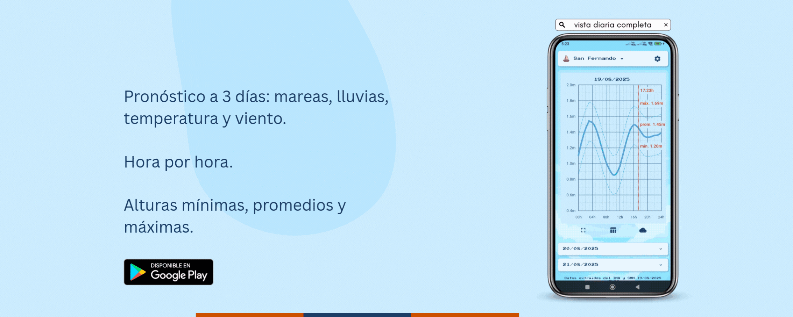

# Mareas — Tide Heights + Weather App (Flutter + Django ETL)

**Mareas** shows the tide curve per station and enriches it with a weather forecast. The backend runs a **Python/Django ETL** that integrates data from **INA** and **SMN**, transforms it, and stores it as **cached JSON** so the **Flutter** frontend can consume it with an **offline-first** experience.

[▶︎ Get it on Google Play](https://play.google.com/store/apps/details?id=com.appmareas.app_mareas)

<p align="center">
  <a href="https://play.google.com/store/apps/details?id=com.appmareas.app_mareas" title="Get it on Google Play">
    
  </a>
</p>

---

## What it does

- **Ingest (Extract):** downloads hydrometric heights from INA (JSON) and the SMN “pron5d” forecast (ZIP/TXT).
- **Transform:**
  - Groups by **date/time** and computes **min/avg/max** height.
  - Interprets **wind** (degrees → 16 compass points), temperature, and precipitation.
  - Time adjustments (Argentina timezone, adds a “23:59” row for continuity).
- **Load:** persists per **station** a `marea_<station>.json` (cache) that the API exposes.
- **Serve:** Django endpoints return the JSON; the Flutter app uses it with local cache and **offline mode**.
- **Automation:** designed for **cron/jobs** (Railway or other). Logging and tolerance to encoding errors.

---

## Tech stack

- **Backend / ETL:** Python 3 · Django · `pandas` · `requests` · scheduled jobs.
- **Sources:** INA (hydrometry) · SMN (5-day forecast).
- **Frontend:** Flutter 3 · `fl_chart` (charts) · `shared_preferences`.
- **Messaging:** Firebase Cloud Messaging (update and promo banners).
- **Monetization:** Google Mobile Ads (Rewarded/Interstitial/Banner) with **alternation + cooldown + preloading**.
- **Deploy:** Railway (environment-aware cache paths).

---

## Key file (ETL)

`marea/scripts/actualizacion.py`

- Downloads and **decodes** SMN’s compressed TXT (tries multiple encodings).
- Detects **blocks by station**, parses rows, and maps wind to a **16-point compass rose**.
- Queries INA in the window **\[00:00 today, +3 days]**, groups, and computes **min/avg/max** per hour.
- **Merges** on `(date, time)` with the forecast, then saves JSON per station (local or `/app/marea/cache` on Railway).
- Executable for **all** stations or a **single** one:

  ```bash
  python marea/scripts/actualizacion.py --todas
  python marea/scripts/actualizacion.py san_fernando
  ```

---

## API (summary)

- `GET /marea/estaciones/` → station catalog (id, name, metadata).
- `GET /marea/alturas/<station_id>/` →

  ```json
  {
    "datos": [
      {
        "fecha": "2025-08-18",
        "hora": "12:00:00",
        "altura_minima": 0.92,
        "altura_promedio": 1.14,
        "altura_maxima": 1.35,
        "temperatura": 21.0,
        "viento_direccion": 45.0,
        "viento_direccion_abreviatura": "NE",
        "viento_direccion_nombre": "Nordeste",
        "viento_direccion_grados": 45.0,
        "viento_km_h": 18,
        "precipitacion_mm": 0.0
      }
    ]
  }
  ```

---

## Flutter app (UX)

- **Compact** and **expanded** chart with **“current time”** line.
- **Hourly table** (min/avg/max).
- **Station selector**, **themes** (dawn/day/sunset/night) and **auto mode**.
- **Offline-first:** local cache + “offline mode” notice.
- **Notifications** in menu (badge) with persistence.
- **Flavors:** `free` (with ads) and `pro` (no ads).

---

## Config structure (frontend)

- `lib/config/anuncios_config.dart` → AdMob IDs (test/production) and **mode switch**.
- `lib/config/app_config.dart` → `esVersionPremium` based on **flavor**.
- `lib/config/backend_config.dart` → `backendBaseUrl` (no trailing `/`).
- `frontend/mareas/lib/config/estaciones_config.dart` → `estacionesHabilitadas` (keep in sync with backend).

---

## Deployment / Automation

- **Railway:** the script detects the environment and writes cache to `/app/marea/cache`.
- **Cron (example):**

  ```cron
  */30 * * * * /usr/bin/python /app/marea/scripts/actualizacion.py >> /var/log/mareas.log 2>&1
  ```

---

## Frontend (Flutter) — Quick start

```bash
# Flutter
flutter pub get

# Free flavor
flutter run --dart-define=FLAVOR=free

# Pro flavor
flutter run --dart-define=FLAVOR=pro
```

**Key configuration**

- `lib/config/backend_config.dart` → API `backendBaseUrl`.
- `lib/config/app_config.dart` → `esVersionPremium` (derived from flavor).
- `lib/config/anuncios_config.dart` → AdMob IDs (test vs. production).
- Visible stations: `frontend/mareas/lib/config/estaciones_config.dart`.

---

## Observability

- **ETL logging** with decoding traces, row counts, and errors per station.
- **Encoding fallbacks** for SMN TXT (avoids crashes due to encoding).
- **Offline-first** on the client (local cache + clear messaging).

---

## Technologies

- **Backend/ETL:** Python, Django, pandas, requests, cron/worker, Railway.
- **Frontend:** Flutter, fl_chart, SharedPreferences, Firebase Messaging, Google Mobile Ads.
- **Build:** Free/Pro flavors, AdMob test IDs in development.

---

## Contact

- **LinkedIn:** [https://www.linkedin.com/in/claudiacaceresv/](https://www.linkedin.com/in/claudiacaceresv/)
